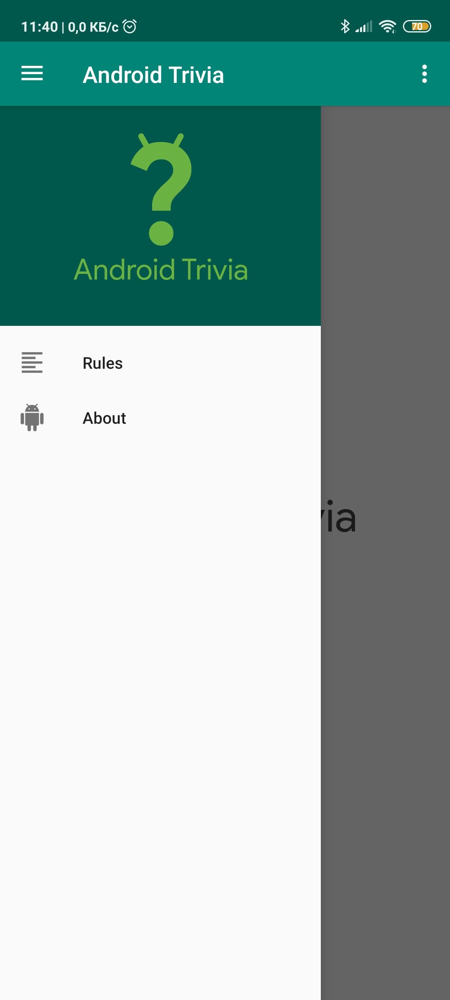
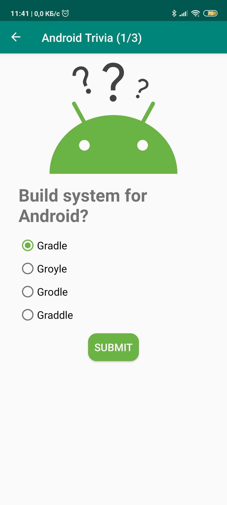
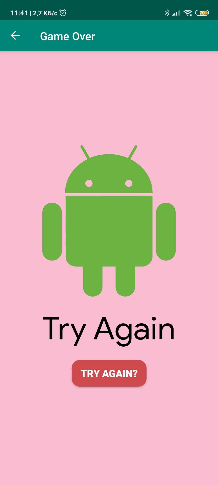

## Android Trivia 

Приложение Android Trivia - это приложение, которое задает пользователю простые вопросы о разработке Android. Он использует навигационный компонент внутри Jetpack для перемещения пользователя между различными экранами. Каждый экран реализован в виде фрагмента.
Приложение перемещается с помощью кнопок, Action Bar и Navigation Drawer.

## Screenshots

    
